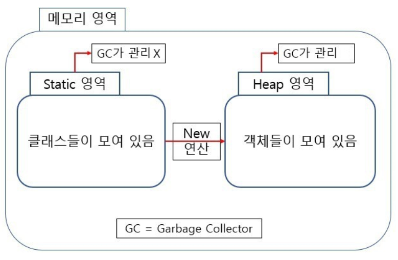
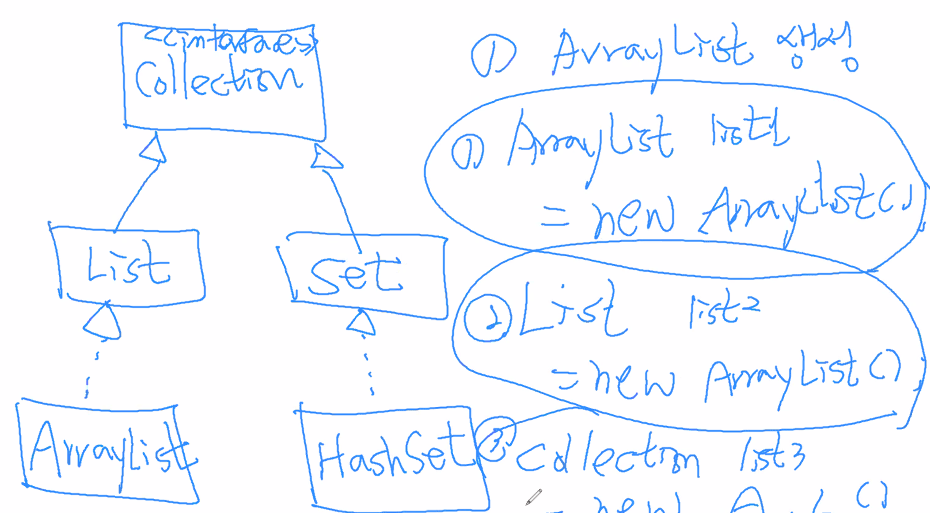

# Java를 잡아라

### 객체지향프로그래밍의 3대 주요 특징!

* 캡슐화
* 추상화
* 다형성

### 추상화

#### 추상메서드

부모 클래스에서 상속받는 자식 클래스가 추상 메서드를 오버라이딩해서 반드시 만들어야하는 메서드이다. 자식 클래스에서 해당 추상 메서드를 안 만들면  에러 난다.

#### 추상클래스 vs 인터페이스

* 추상클래스

  * **추상메서드, 일반메서드, 멤버변수**로 구성가능하다. 
  * **자체적으로 객체 생성이 불가능**하다. 자식클래스가 해당 추상클래스를 상속받아 객체 생성이 가능하다.

  * 추상메서드는 <u>**abstract**</u>라고 명시해주어야 한다.

    ```java
    public abstract test();
    ```

  * 추상클래스에서 추상메서드에 접근제어자를 명시하지 않았을 때, **default**이다. 이는 같은 패키지인 클래스에서 접근 가능한 메서드인 것이다.

    ```java
    // 접근제어자
    public > protected > default > private
    ```

* 인터페이스

  공통 작업을 할 수 있도록 **공통된 기능 간의 일관성**을 제공한다.

  인터페이스에서 작성된 멤버변수와 메서드는 모두 추상멤버변수, 추상메서드이다. 접근제어자를 명시하지 않았을 때, 기본적으로 멤버변수는 **public static final 멤버변수;** 가 되고 메서드는 **<u>public abstract</u> 추상메서드();**가 된다. 즉, 기본 접근제어자가 **public**인 것이다.

  객체 생성은 안되지만 **Ref 변수**로 쓰일 수 있다.

  ```java
  // Pet.interface 있다고 가정
  Pet puppy = new Puppy();
  ```

### 다형성

poly(다양한) + morphism (변형/변신)

One Interface, Multiple Implementation

```java
Employee mgr = new Manager();
Employee clerk = new Clerk();
```

* Homogeneous Collection

```java
Employee[] emps = new Employee[3];
emps[0] = new Employee();
emps[1] = new Employee();
emps[2] = new Employee();
```

* Heterogeneous Collection

클래스가 추가되거나 바뀌더라도 특정 부모 클래스를 동일하게 상속받은 자식을 하나의 배열에 관리할 수 있어 코드를 바꾸어야 하는 수고로움이 적다.

```java
Employee[] emps = new Employee[3];
emps[0] = new Manager();
emps[1] = new Clerk();
emps[2] = new Clerk();
```

**특징! **

* 부모를 자식으로 형변환 x  

  ```
  Cat cat = new Pet();
  ```

* **자식을 부모로 형변화 o**

  ```java
  Pet p = new Cat();
  ((Cat) p).eat();
  ```

  

---

### Static 키워드 (헷갈렸던 부분)



* 전체 객체에서 공용으로 쓰인다.

  class는 **static영역**에 생성된다. new 연산으로 생성된 객체는 **heap영역**에 생성된다. static 영역은 **Garbage Collector가 관리하지 않는 영역**이기 때문에 프로그램이 종료되기 전까지 메모리에 계속 할당되어 존재한다. 즉, static 키워드로 선언된 메모리는 모든 객체가 공유한다는 장점을 갖지만, 프로그램 성능에 악영향을 주므로 잘 고려해서 사용해야한다. 

  다른 클래스에서 사용할 때, static 변수는**[클래스이름].[static변수이름]**으로, static 메서드는 **[클래스이름].[static메서드이름]**으로 사용한다.

* class가 load될 때, static 변수와 static 메서드는 메모리에 생성된다. 따라서 다음과 같이 말할 수 있다.

  ```java
  static 변수 = class 변수
  static 메서드 = class 메서드
  ```

* ★ **static 메서드 안에서 this, super, non-static 멤버를 사용할 수 없다. 오직 static 변수 또는 static 메서드만 사용가능하다. (단, static 메서드 안에서 정의한 local 변수는 사용가능하다.)**

```java
//MyCount.java
public class MyCount {
	private int serialNumber;
	private static int counter;
	   
	   public MyCount() {
		  serialNumber++;
	      counter++;
	   }
	   
	   public int getSerialNumber() {
	      return this.serialNumber;
	   }
	   
	   public static int getCounter() {
	      return counter;
	   }
	   
	   public void increaseSerialNumber() {
		   serialNumber++;
	   }
	   
	   public static void increaseCounter() {
		   counter++;
	   }
}
```

```java
//MyCountTest.java
public class MyCountTest {

   public static void main(String[] args) {
      MyCount count1 = new MyCount();
      MyCount count2 = new MyCount();
      
      System.out.println(count1.getSerialNumber());//1
      count1.increaseSerialNumber();
      count1 = null;
      System.out.println(count1.getCounter()); //2
      count1.increaseCounter();
      
      System.out.println(count2.getSerialNumber());
      System.out.println(MyCount.getCounter());
   }
}
// 출력결과
// 1
// 2
// 1
// 3
```

Q1. count1을 null을 할당했다. count1.getCounter()이 실행이 가능할까?

Q2. count2가 아닌 MyCount로 getCounter 메서드에 접근했다. 가능할까?

**가능하다!**

**클래스 변수와 클래스 메서드는 객체의 주소로 접근하지 않는다.** static 변수와 static 메서드는 클래스에 속한 변수나 메서드이기 때문에 **객체생성과 무관**하다

---

### final 키워드

* final class는 상속이 불가능하다.

* final method 는 override가 불가능하다.

* final variable 값 변경이 불가능하다. 단, 선언시 초기화를 안했을 경우 해당 변수를 사용하기 전에 constructor로 초기화해주어야한다.

  

---

### Collection

