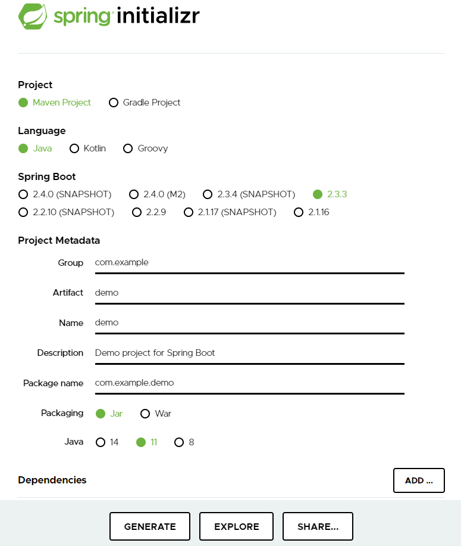
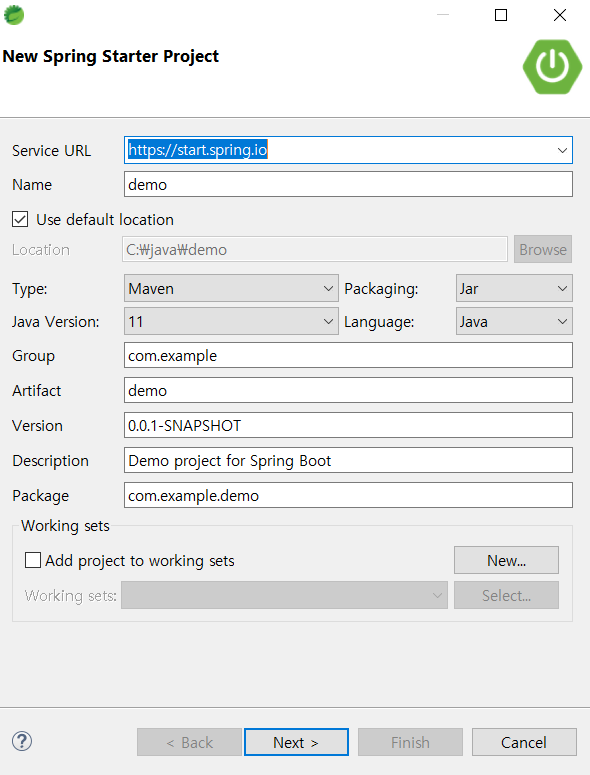
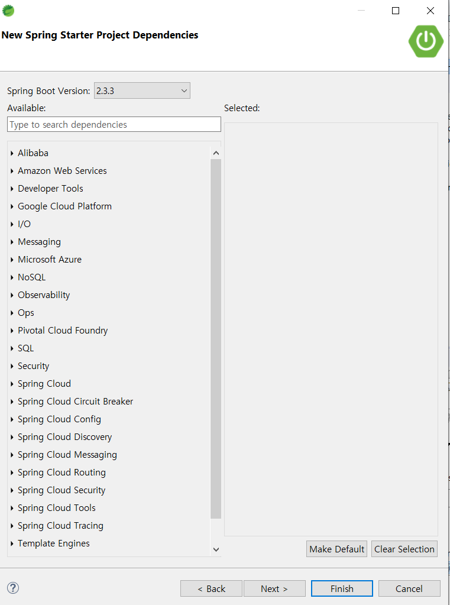

## Spring Initializr 필드 조사

#### 1. Project

Maven과 Gradle은 **Build Tool**이다.

> build tool 이란 간단히 설명하자면,
>
> - 새로운 기능을 쉽게 설치하고 업데이트할 수 있다.
> - 개발 가이드 라인을 제공한다.
> - 프로젝트 정보를 제공한다.

#### (1) Maven

pom.xml과 같은 **xml 파일**을 통해서 어플리케이션 버전, 라이브러리 항목을 설정할 수 있다.

#### (2) Gradle

if, else, for 로직을 **스크립트 언어**로 작성하여 어플리케이션 버전, 라이브러리 항목을 설정할 수 있다.

##### * 왜 Gradle이 Maven보다 좋은가?

**동적 Build**를 정적인 XML로 정의하기 어렵다.  

> 동적?
>
> - 동적 Build를 고려해서 XML을 작성한다면 설정 내용이 길어지고 가독성 떨어짐
> - 의존관계가 복잡한 프로젝트 설정하기에는 부적절
> - 상속구조를 이용한 멀티 모듈 구현
> - 특정 설정을 소수의 모듈에서 공유하기 위해서는 부모 프로젝트를 생성하여 상속하게 해야함 (상속의 단점 생김)

스크립트 언어로 플러그인을 호출하거나 코드를 작성할 수 있다.

> - Configuration Injection 방식을 사용해서 공통 모듈을 상속해서 사용하는 단점을 커버했다.
> - 설정 주입시 프로젝트의 조건을 체크할 수 있어서 프로젝트별로 주입되는 설정을 다르게 할 수 있다.

#### 2. Language

프로젝트 개발 언어. Java로 개발할 예정.

#### 3.  Spring Boot 

스프링부트 버전, 2.1.16에서 할 예정.

#### 4. Project Metadata

생성할 스프링 부트 프로젝트 관련 정보

|              |                                                         |
| ------------ | ------------------------------------------------------- |
| Group        | 프로젝트가 위치할 패키지(도메인 명) com.example    |
| Artifact     | 단순 이름 demo                                     |
| Name         | 단순 이름 demo                                     |
| Description  | 프로젝트 설명 demo project for Spring Boot         |
| Project name | 프로젝트가 위치할 패키지 +  프로젝트명 com.example |

---

STS4에서 Spring Boot 프로젝트 설정을 완료하면 다음과 같은 디렉토리 구조를 갖는다.

