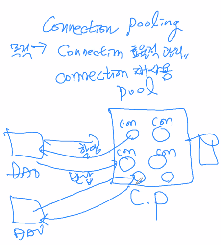

### config관련 xml파일 관련 개념

#### 1. 스키마: xsd

.xsd 스키마 파일에 xml rule을 지정해두었다. 이 rule에 따라 xml을 작성할 수 있다. 

```xml
<beans xmlns="http://www.springframework.org/schema/beans"
  xmlns:xsi="http://www.w3.org/2001/XMLSchema-instance"
  xmlns:context="http://www.springframework.org/schema/context"
  xsi:schemaLocation="http://www.springframework.org/schema/beans http://www.springframework.org/schema/beans/spring-beans.xsd
      http://www.springframework.org/schema/context http://www.springframework.org/schema/context/spring-context.xsd">

```


#### 2. namespace

```xml
<!-- Component Auto Scanning하기 위한 설정 -->
   <context:component-scan base-package="myspring.di.annotation"/>

   <!-- StringPrinter 클래스를 Bean으로 등록 -->
   <bean id="strPrinter" class="myspring.di.xml.StringPrinter" />
```

패키지 역할과 유사하다. 기능별로 그룹핑해서 나눴다. namespace가 다르면 이름이 달라도 된다. 이름공간이 다르면 태그명이 동일하게 다.

* bean 태그는 beans xml이 제공하는 default namespace를 이용

* component-scan context xml이 


### 메타 정보 구성 전략

#### 전략 1 XML 설정 단독

#### 전략 2 어노테이션과 XML 설정 혼용

#### 전략 3 어노테이션 설정 단독


---


https://docs.oracle.com/javase/8/docs/api/ → DataSource


커넥션 풀링(Connection Pooling)

웹에서 요청이 많으면 커넥션 셰어

커넥션 관리방법



목적: 커넥션 효율적 관리해서 커넥션 재사용

클라이언트 → 서버


참고 스레드풀링