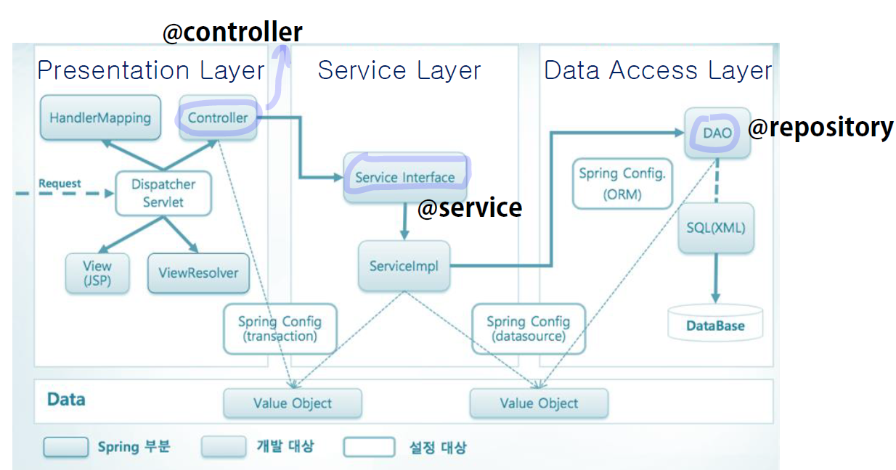

### Layered Architecture

1. **Presentation Layer** : 서비스 사용자와 직접적인 상호작용을 담당

   Controller → 어노테이션 '@controller'

2. **Service Layer**: 비즈니스 로직

   Service → 어노테이션 '@service'

3. **Data Access Layer**: 데이터베이스 접근 로직

   Repository → 어노테이션 '@repository'

<u>business logic과 db access logic은 'Dao 하나'로 묶어도 된다.</u>

#### 근데 왜 Service Layer와 Data Access Layer를 나눌까?

**낮은 의존성 + 코드 재사용**

 지금 RDBMS를 이용해서 개발하고 있다고 가정한다. 만약에 어떤 상황이 되어 NoSQL DB로 바꿔야할 경우 하나로 묶은 Dao는 재사용이 불가능하다. 

---

### DataSource 

[datasource 참고 문서](https://docs.oracle.com/javase/8/docs/api/) 

### MyBatis 

**1. MyBatis 장점 및 특징**

**2. MyBatis 종류**

아키텍쳐 및 주요 컴포넌트 역할 이해하기

* MyBatis3
* MyBatis-Spring

MyBatis - SqlSessionFactory, SqlSession

: MyBatis-Spring - SqlSessionFactoryBean, SqlSessionTemplate 어떤 역할이고, 무엇인지?

: MyBatis 의 구조