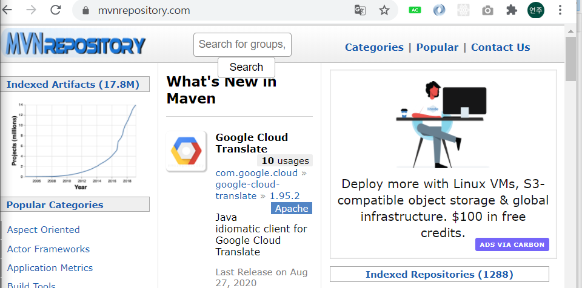
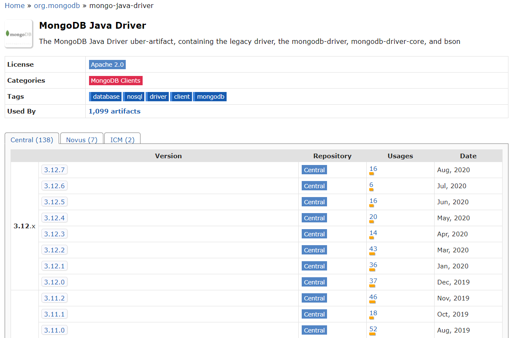
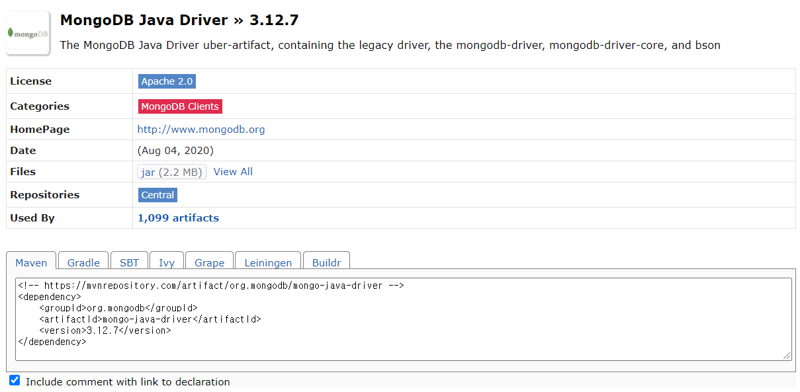
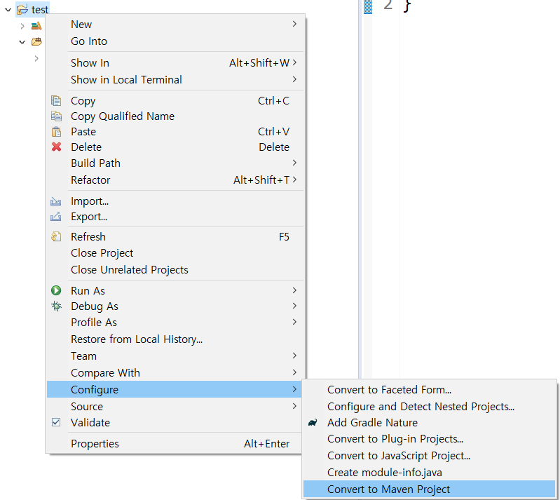
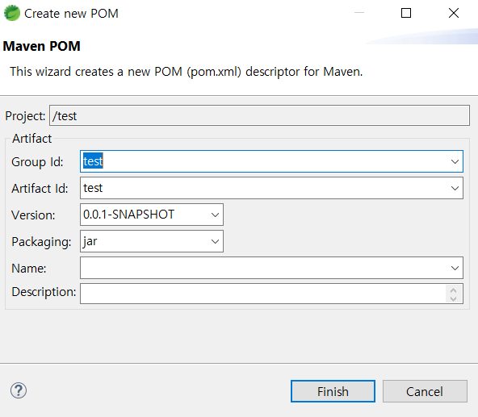
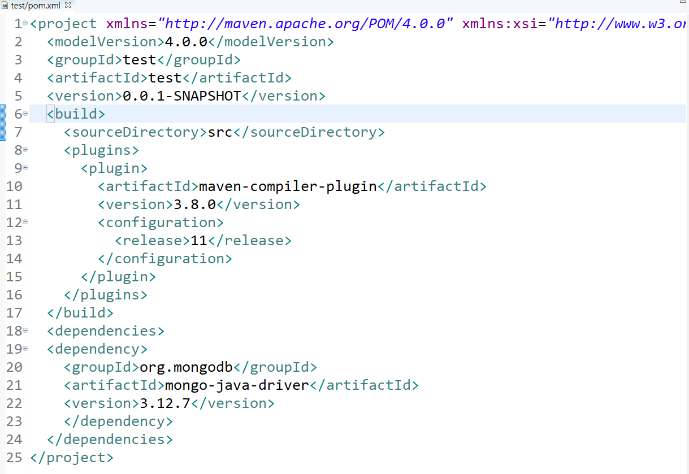
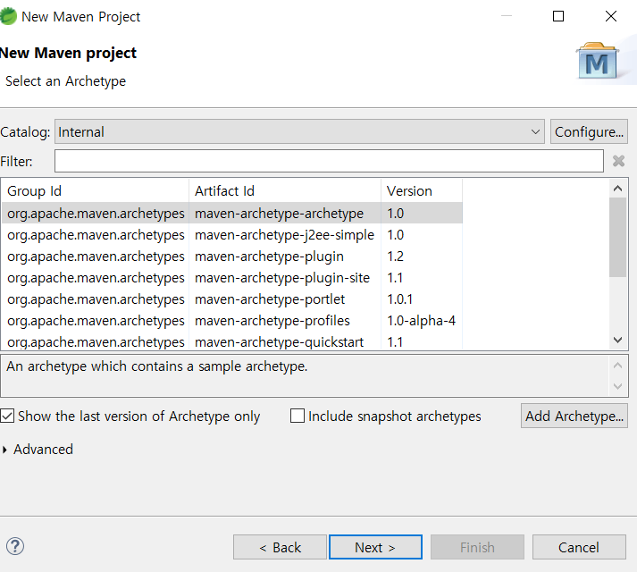
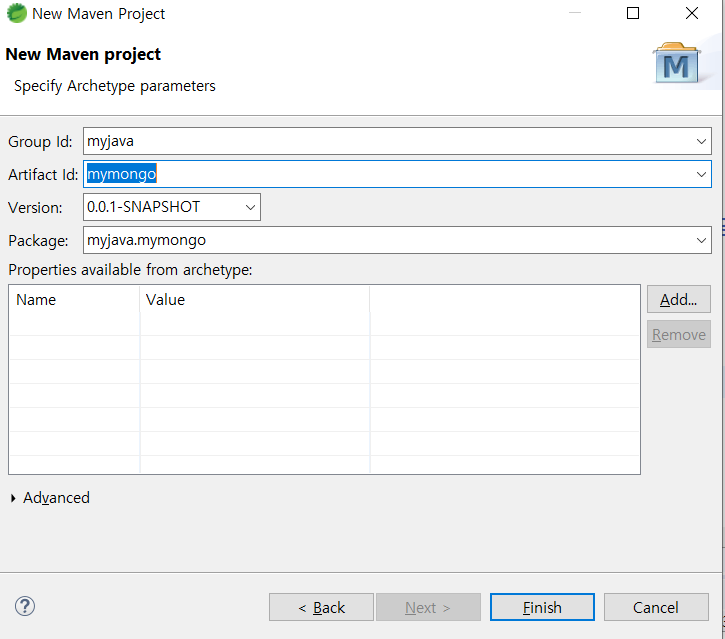

# Apache Maven

**Java계열에서 대표적인 load package manager**

javascript 계열에서 대표적인 load package manager는 npm

[mongo java driver](https://mongodb.github.io/mongo-java-driver/)

[maven repository](https://mvnrepository.com/) 에서 **mongo java driver** 검색

#### Maven 설정 방법 2가지

1. 기존 Java project를 Maven project로 변환(convert)
2. 처음부터 Maven project로 생성

그러면 pom.xml 파일 생성된다!

#### 1) 기존 Java project를 Maven project로 변환(convert)

test라는 프로젝트를 생성했다. 해당 프로젝트를 maven 프로젝트로 변환하기 위해  **Configure → Convert to Maven Project**로 해준다.

**[Convert to Maven Project]** 를 누르면 다음과 같은 창이 뜬다. POM.xml을 정해줄 수 있다.

**Finish 버튼**을 누르면 디렉토리는 다음과 같은 구조를 갖는다.

내가 만든 java maven 프로젝트에서 mongodb를 사용해야 하는 경우라면, maven repository에서 mongodb를 검색해서 maven dependency를 복사하여 pom.xml에 dependency를 추가 해준다. 

dependency 추가 이후 재시작(ctrl+f5)하면 추가된 dependency가 컴파일이 되면서 **maven dependencies**에 **mongodb 관련 jar 파일**이 추가된다.

------

#### 2) 처음부터 Maven project로 생성

#### Maven에서 라이브러리 설치 방식

* pom.xml에 dependency 추가

* .m2