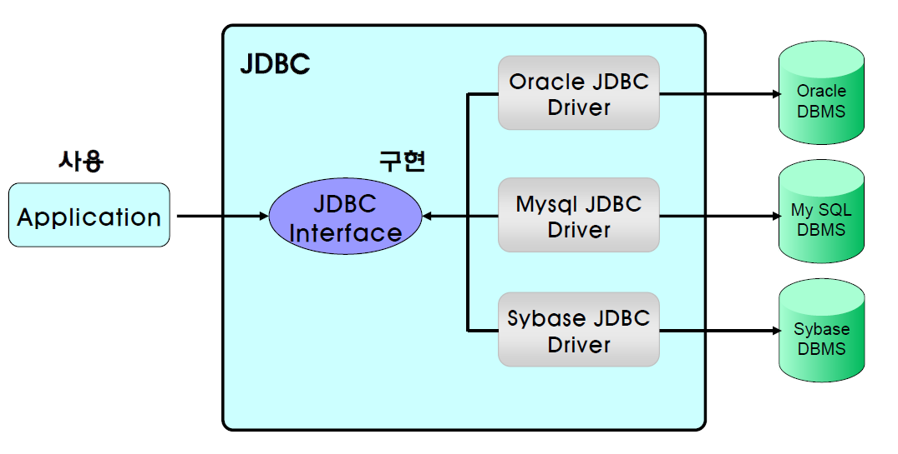
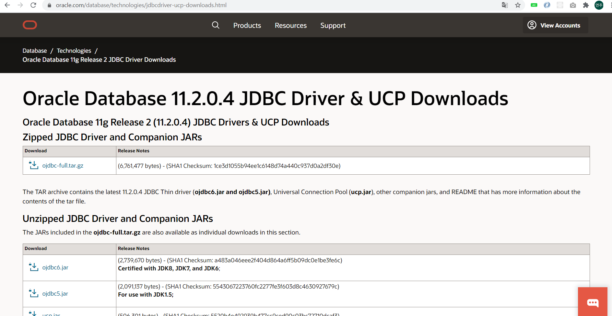
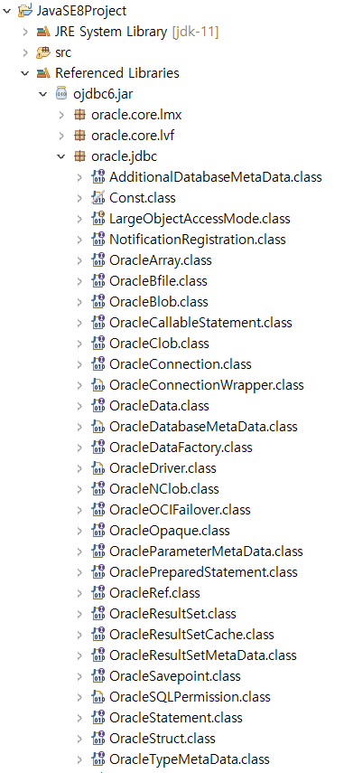
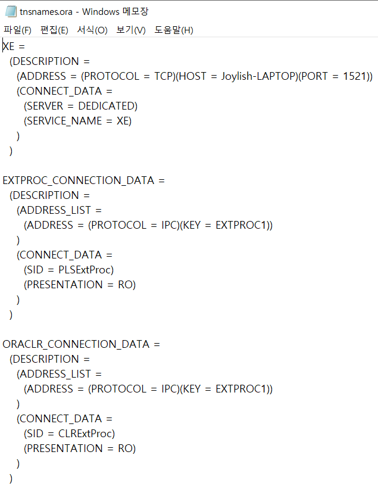
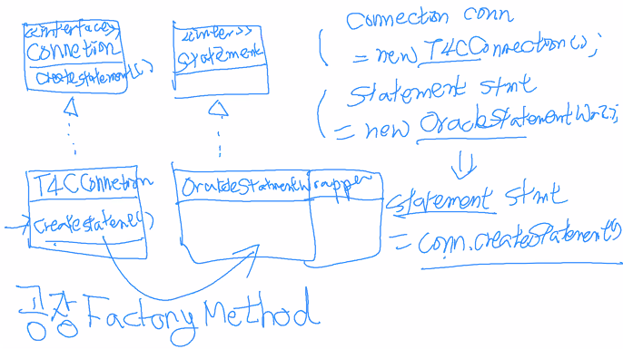
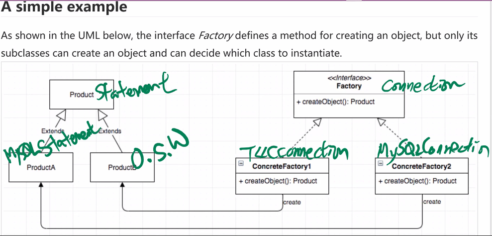
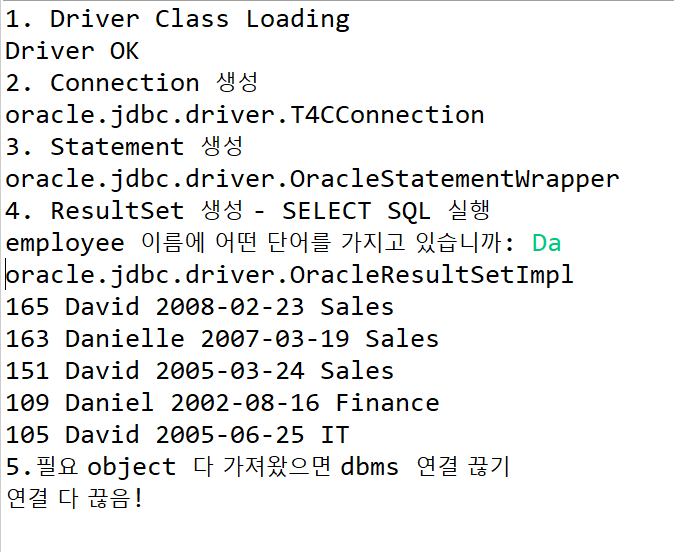

# Jdbc ♪






#### java에서 jdbc로 Oracle 연결하는 전과정

```
driver 등록 → connection 객체 생성 → dbms 연결 → statement 생성 → query 실행 → result set 결과 객체 받기 → close() db 연결 닫기
```

 

#### 1. driver 등록

```java
class.forName("oracle.jdbc.driver.OracleDriver");
```

 forName에 특정 db driver를 주면 알아서 객체를 만들어서 반환한다.

OracleDriver에 종속되지 않기 위해서  new OracleDriver();이 아닌 Class.forName() 을 사용한다.

```java
// 1. Driver Class Loading
// Unhandled exception type ClassNotFount
    try {
        Class.forName("oracle.jdbc.OracleDriver");
        System.out.println("Driver OK");
    } catch(ClassNotFoundException e) {
        // 오류 메시지 출력
        System.out.println(e.getMessage());
        // 오류 메시지를 메서드 호출 경로와 함께 출력
        e.printStackTrace();
    }
```



### 2. driver 연결

```java
System.out.println("2. Connection 생성");
// 프로토콜: jdbc, 서브프로토콜: oracle
// 서비스 또는 tnsnames.ora로 dbms 아이디 확인하기
// 확인했더니 dbms 아이디: xe
try{
    String url = "jdbc:oracle:thin:@127.0.0.1:1521:xe";
    String user = "hr";
    String password = "hr";
    Connection conn = DriverManager.getConnection(url, user, password);
    System.out.println(conn.getClass().getName());
}catch(SQLException e){
    e.printStackTrace();
}
```

##### (참고) tnsnames.ora 확인하는 방법

`C:\oraclexe\app\oracle\product\11.2.0\server\network\ADMIN` 에 들어가면 tnsname.ora 파일이 있다. 이 파일을 열어보면 현재 설치한 oracle db/서비스의 아이디를 확인할 수 있다.



### 3. dbms 연결

```java
System.out.println("3. Statement 생성");
try{
    Statement stmt = conn.createStatement();
    System.out.println(stmt.getClass().getName());
}catch(SQLException e){
    e.printStackTrace();
}
```


### 4. statement 생성

#### Statement

```java
System.out.println("4. ResultSet 생성 - SELECT SQL 실행");
String sql = "select * from employees";
try{
    ResultSet rs = stmt.executeQuery(sql);
	System.out.println(rs.getClass().getName());
}catch(SQLException e){
    e.printStackTrace();
}
```

만약 sql 쿼리가 엄~청 길다면?

```sql
String sql = "select EMPLOYEE_ID, FIRST_NAME, HIRE_DATE, DEPARTMENT_NAME\r\n" + "from EMPLOYEES e, DEPARTMENTS d\r\n" + 
"where e.DEPARTMENT_ID = d.DEPARTMENT_ID\r\n" + "order by EMPLOYEE_ID desc";
```

매번 \n도 넣어줘야하고 + 넣어줘야하고 보기 않조다... 해결방안?!

**StringBuilder**

```java
StringBuilder builder = new StringBuilder();
		builder
		.append("select EMPLOYEE_ID, FIRST_NAME, HIRE_DATE, DEPARTMENT_NAME ")
		.append("from EMPLOYEES e, DEPARTMENTS d ")
		.append("where e.DEPARTMENT_ID = d.DEPARTMENT_ID ")
		.append("order by EMPLOYEE_ID desc ");
```


#### PreapareStatement

Statement를 상속한 자식클래스이다. 같은 Query를 반복 수행해야 하는 경우 성능이 좋다. 반복문 이용시 용이하다.

* preapareStatement()

* setString(), setInt(), ...

  String 타입인 sql 변수에 insert sql 쿼리문이 할당된다. 이 쿼리문에 ?가 있는 것을 볼 수 있는데,  ?는 함수로 치면 argument로 ? 위치에 각각 인자로 값을 할당할 수 있다.

  **? 에 어떻게 값을 넘겨줄 수 있을까**

  setXXX() 함수(setString(), setInt(), ...)로  어느 ?의에 어떤 값을 넣을 건지 정해주면 된다.

  prepareStatement()로 생성된 statement에 `stmt.setString(1, user.getUserId());`로 sql 스트링의 첫번째 ?에 user.getUser()의 값을 넘겨준다. 

  (참고) insertUser함수의 인자로 UserVO타입의 데이터가 전달된다. UserVO는 캡슐화되어있기 때문에 각 멤버변수 값은 getXX()로 불러온다.

```java
	public int insertUser(UserVO user) {
		int result = -1;
		String sql = "insert into users values (?, ?, ?, ?)";
		try {
			Connection conn = getConnection();
			conn.setAutoCommit(false);
            
			PreparedStatement stmt = conn.prepareStatement(sql);
			stmt.setString(1, user.getUserId());
			stmt.setString(2, user.getName());
			stmt.setString(3, user.getGender());
			stmt.setString(4, user.getCity());
			
			result = stmt.executeUpdate();
            
            if(result == 1){
                conn.commit();
            }else{
                conn.rollback();
            }
            
			close(stmt, conn);
	
		} catch (SQLException e) {
			e.printStackTrace();
		}
		return result;
		
	}
```


----

#### ★ factoryMethod

* 왜 new T4cConnection();가 아니라 DriverManager.getConnection()을 사용하지?

* 왜 new OracleStatement(); 이 아니라DriverManager.getConnection().createStatement()을 사용하지? 

**다른 dbms driver로 바뀌면 특정 dbms driver의 class이름을 알아내서 써주지 않아도 된다. 오라클에 완전 종속해버린다.**

forName(), getConnection(), createStatement()를 factoryMethod라고 한다. factoryMethod는 객체생성메서드로, 특정 객체를 만든다.





### 전체코드

```java
package jdbc;

import java.sql.Connection;
import java.sql.Date;
import java.sql.DriverManager;
import java.sql.ResultSet;
import java.sql.SQLException;
import java.sql.Statement;
import java.util.Scanner;

public class EmployeeSelectTest {
	public static void main(String[] args) {
		String url = "jdbc:oracle:thin:@127.0.0.1:1521:xe";
		String user = "hr";
		String password = "hr";
		Connection conn = null;
		Statement stmt = null;
		
		try {
			System.out.println("1. Driver Class Loading");
			Class.forName("oracle.jdbc.OracleDriver");
			System.out.println("Driver OK");
			
			System.out.println("2. Connection 생성");
			// 프로토콜: jdbc, 서브프로토콜: oracle
			// 서비스 또는 tnsnames.ora로 dbms 아이디 확인하기
			// dbms 아이디: xe	
			conn = DriverManager.getConnection(url, user, password);
			System.out.println(conn.getClass().getName());
			
			System.out.println("3. Statement 생성");
			stmt = conn.createStatement();
			System.out.println(stmt.getClass().getName());
			
			System.out.println("4. ResultSet 생성 - SELECT SQL 실행");
			Scanner sc = new Scanner(System.in);
			System.out.print("employee 이름에 어떤 단어를 가지고 있습니까: ");
			String whatlike = sc.next();
			StringBuilder builder = new StringBuilder();
			builder
			.append("select EMPLOYEE_ID, FIRST_NAME, HIRE_DATE, DEPARTMENT_NAME ")
			.append("from EMPLOYEES e, DEPARTMENTS d ")
			.append("where e.DEPARTMENT_ID = d.DEPARTMENT_ID ")
			.append("and FIRST_NAME like '%"+whatlike+"%'")
			.append("order by EMPLOYEE_ID desc");
			String sql = builder.toString();
			ResultSet rs = stmt.executeQuery(sql);
			System.out.println(rs.getClass().getName());
			/*
			 EMPLOYEE_ID                               NOT NULL NUMBER(6)
			 FIRST_NAME                                         VARCHAR2(20)
			 LAST_NAME                                 NOT NULL VARCHAR2(25)
			 EMAIL                                     NOT NULL VARCHAR2(25)
			 PHONE_NUMBER                                       VARCHAR2(20)
			 HIRE_DATE                                 NOT NULL DATE
			 JOB_ID                                    NOT NULL VARCHAR2(10)
			 SALARY                                             NUMBER(8,2)
			 COMMISSION_PCT                                     NUMBER(2,2)
			 MANAGER_ID                                         NUMBER(6)
			 DEPARTMENT_ID                                      NUMBER(4)
			 */
			while(rs.next()) {
				int id = rs.getInt("EMPLOYEE_ID");
				String name = rs.getString("FIRST_NAME");
				Date hdate = rs.getDate("HIRE_DATE");
				String dname = rs.getString("DEPARTMENT_NAME");
				System.out.println(id+ " "+ name + " "+ hdate + " " + dname);
			}
		} catch(ClassNotFoundException|SQLException e) {
			e.printStackTrace();
		} finally {
			System.out.println("5.필요 object 다 가져왔으면 dbms 연결 끊기");
			try {
				if(stmt != null) stmt.close();
				if(conn != null) conn.close();
			} catch (SQLException e) {
				e.printStackTrace();
			}
			System.out.println("연결 다 끊음!");
		}
		
	}
}

```

