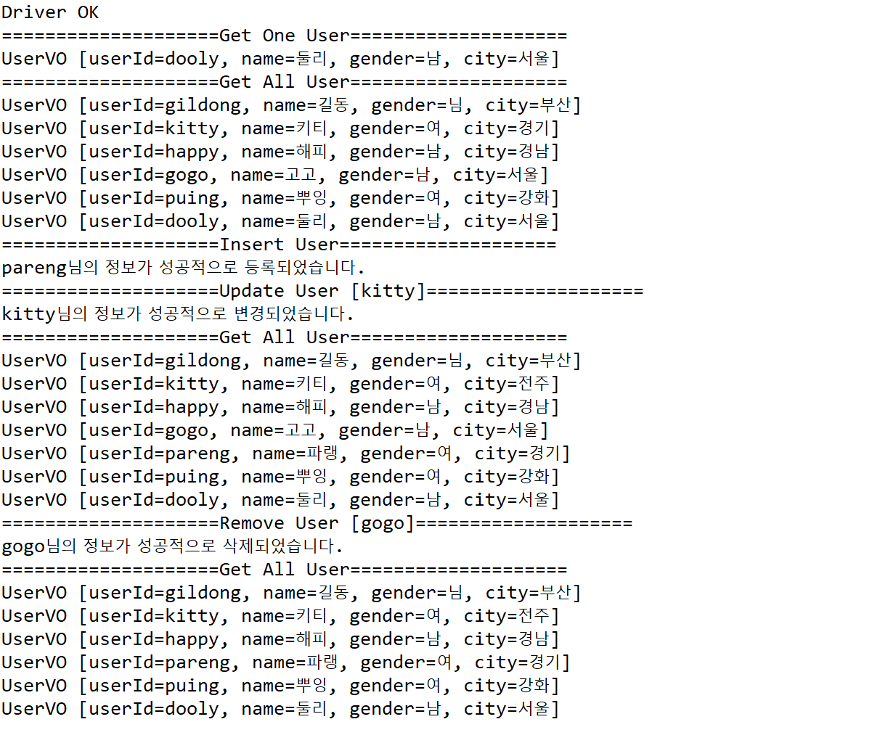

# Jdbc ♪

#### `Java에서 DML 적용하기`

### ORM(Object Relation Mapping)

Java에서 **DB Table에 대응**되는 Class를 **VO(Value Object) Class**라고 한다. 

| Java            | DB               |
| --------------- | ---------------- |
| Class           | Table            |
| Object          | Table Row(Tuple) |
| member variable | Table Column     |


### VO (Value Object)

VO Class는 user와 관련된 데이터를 모아둔 **바구니**와 같다.

```java
package jdbc.user.vo;

public class UserVO {
	private String userId;
	private String name;
	private String gender;
	private String city;
	
	public UserVO() {}

	public UserVO(String userId, String name, String gender, String city) {
		super();
		this.userId = userId;
		this.name = name;
		this.gender = gender;
		this.city = city;
	}

	public String getUserId() {
		return userId;
	}

	public void setUserId(String userId) {
		this.userId = userId;
	}

	public String getName() {
		return name;
	}

	public void setName(String name) {
		this.name = name;
	}

	public String getGender() {
		return gender;
	}

	public void setGender(String gender) {
		this.gender = gender;
	}

	public String getCity() {
		return city;
	}

	public void setCity(String city) {
		this.city = city;
	}

	@Override
	public String toString() {
		return "UserVO [userId=" + userId + ", name=" + name + ", gender=" + gender + ", city=" + city + "]";
	}
}
```


 ### DAO (Data Access Object)

java 소스코드로 db에 저장된 데이터를 조작할 수 있다. 즉, java 프로그램에서 작성한 DML을 실행하여 데이터를 불러오고 변경할 수 있는 것이다.

다음은 사용자 데이터 관련 DAO class 이다.

```java
package jdbc.user.dao;

import java.sql.Connection;
import java.sql.DriverManager;
import java.sql.PreparedStatement;
import java.sql.ResultSet;
import java.sql.SQLException;
import java.sql.Statement;
import java.util.ArrayList;
import java.util.List;

import jdbc.user.vo.UserVO;

public class UserDAO {
	String url = "jdbc:oracle:thin:@127.0.0.1:1521:xe";
	String user = "scott";
	String password = "tiger";
	

	public UserDAO(){	
		try {
			Class.forName("oracle.jdbc.OracleDriver");
			System.out.println("Driver OK");
		}catch(ClassNotFoundException e) {
			e.printStackTrace();
		}
	}
	
	public Connection getConnection() throws SQLException {
		return DriverManager.getConnection(url, user, password);
	}
	
	public void close(Statement stmt, Connection conn) throws SQLException{
		if(stmt != null) stmt.close();
		if(conn != null) conn.close();
	}
	
	// user 1명 조회
	public UserVO getUser(String userId) {
		UserVO user = null;
		String sql = "select * from users where USERID = ?";
		try {
			Connection conn = getConnection();
			
			// PreparedStatement: Statement를 상속받음
			PreparedStatement stmt = conn.prepareStatement(sql);
			stmt.setString(1, userId);
			
			ResultSet rs = stmt.executeQuery();
			while(rs.next()) {
				user = new UserVO(
						rs.getString("userid"),
						rs.getString("name"),
						rs.getString("gender"),
						rs.getString("city"));
			}
			close(stmt, conn);
	
		} catch (SQLException e) {
			// TODO Auto-generated catch block
			e.printStackTrace();
		}
		return user;
	}
	
	public List<UserVO> getUsers(){
		List<UserVO> users = new ArrayList<>();
		String sql = "select * from users";
		try {
			Connection conn = getConnection();
			
			Statement stmt = conn.createStatement();
			
			ResultSet rs = stmt.executeQuery(sql);
			while(rs.next()) {
				users.add(new UserVO(
						rs.getString("userid"),
						rs.getString("name"),
						rs.getString("gender"),
						rs.getString("city")));
			}
			close(stmt, conn);
	
		} catch (SQLException e) {
			e.printStackTrace();
		}
		return users;		
	}
	
	public int insertUser(UserVO user) {
		int result = -1;
		String sql = "insert into users values (?, ?, ?, ?)";
		try {
			Connection conn = getConnection();
			
			PreparedStatement stmt = conn.prepareStatement(sql);
			stmt.setString(1, user.getUserId());
			stmt.setString(2, user.getName());
			stmt.setString(3, user.getGender());
			stmt.setString(4, user.getCity());
			
			result = stmt.executeUpdate();
			close(stmt, conn);
	
		} catch (SQLException e) {
			e.printStackTrace();
		}
		return result;	
	}
	
	// user 정보가 바뀌었을 경우
	public int updateUser(String userId, String key, String value) {
		int result = -1;
		String sql = "update users set "+ key + "= ? where userId = ?";
		try {
			Connection conn = getConnection();
			PreparedStatement stmt = conn.prepareStatement(sql);
			stmt.setString(1, value);
			stmt.setString(2, userId);
			result = stmt.executeUpdate();
			close(stmt, conn);
	
		} catch (SQLException e) {
			e.printStackTrace();
		}
		return result;	
	}
	
	public int removeUser(String userId) {
		int result = -1;
		String sql = "delete from users where userId = ?";
		try {
			Connection conn = getConnection();
			PreparedStatement stmt = conn.prepareStatement(sql);
			stmt.setString(1, userId);
			result = stmt.executeUpdate();
			close(stmt, conn);
	
		} catch (SQLException e) {
			e.printStackTrace();
		}
		return result;	
	}
}
```

```java
package jdbc.user.test;

import jdbc.user.dao.UserDAO;
import jdbc.user.vo.UserVO;

public class UserTest {
	UserDAO dao = new UserDAO();
	
	public void getUser(String userId) {
		System.out.println("=".repeat(20)+"Get One User"+"=".repeat(20));
		System.out.println(dao.getUser(userId).toString());
	}
	
	public void getUsers() {
		System.out.println("=".repeat(20)+"Get All User"+"=".repeat(20));
		for(UserVO user: dao.getUsers()) {
			System.out.println(user.toString());
		}
	}
	
	public void addUser(String userId, String name, String gender, String city) {
		System.out.println("=".repeat(20)+"Insert User"+"=".repeat(20));
		if(dao.insertUser(new UserVO(userId, name, gender, city))>0) {
			System.out.println(userId+"님의 정보가 성공적으로 등록되었습니다.");
		}else {
		System.out.println(userId+"님을 등록하지 못했습니다.");
		}
	}
	
	public void updateUser(String userId, String key, String value) {
		System.out.println("=".repeat(20)+"Update User ["+userId+"]"+"=".repeat(20));
		if(dao.updateUser(userId, key, value)>0) {
			System.out.println(userId+"님의 정보가 성공적으로 변경되었습니다.");
		}else {
		System.out.println(userId+"님의 정보 변경에 실패하였습니다.");
		}
	}
	
	public void removeUser(String userId) {
		System.out.println("=".repeat(20)+"Remove User ["+userId+"]"+"=".repeat(20));
		if(dao.removeUser(userId)>0) {
			System.out.println(userId+"님의 정보가 성공적으로 삭제되었습니다.");
		}else {
		System.out.println(userId+"님의 정보 삭제에 실패하였습니다.");
		}
	}
	
	public static void main(String[] args)  {
		UserTest test = new UserTest();
		test.getUser("dooly");
		test.getUsers();
		test.addUser("pareng", "파랭", "여","경기");
		test.updateUser("kitty", "city", "전주");
		test.getUsers();
		test.removeUser("gogo");
		test.getUsers();
	}
}
```

