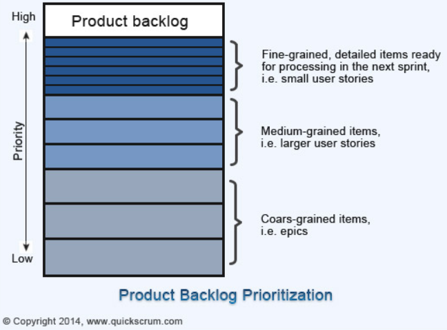

# Scrum

#### Scrum 진행과정

스크럼 반복주기는 1~4주, 이를 **스프린트**라고 부른다.

스프린트를 진행하기 전에 다음과 같은 세 단계가 필요하다. 

```
product backlog → spring planning meeting → sprint backlog
```

**prouduct backlog** 단계에서는 제품 책임자가 주도하여 **사용자 스토리**를 기반으로 제품 백로그를 작성한다.

**sprint planning meeting** 단계에서 제품책임자, 스크럼 마스터, 개발팀이 참여하여 product backlog를 기반으로 이번 sprint 목표와 스프린트 백로그를 계획한다. 

* 스프린트 계획 파트1: **무엇(what)**을 할 지 우선순위가 높은 요구사항을 검토하고 스프린트 목표를 정한다.
* 스프린트 계획 파트2: 계획파트1에서 결정한 what을 **어떻게(how)** 실행할지 결정한다.
* **스프린트 약속**: 스프린트가 끝날 때마다 어떤 결과물을 낼 것인지 현실적인 목표를 정한다. 

**sprint backlog** 단계에서 product backlog에서 결정된 우선순위를 기반으로 언제 특정 요구사항들을 구현할지 task 단위로 나누어 일정을 리스트화한다. 

---

#### Who is 스크럼 마스터

개발팀의 구성원들을 코칭하고 프로젝트 진행 중 문제가 생겼을 때 해결할 수 있도록 도와주는 역할을 맡는다.


#### What is 사용자 스토리

사용자 스토리는 고객, 개발자 모두 이해할 수 있도록 고객이 작성하는 것이다.

사용자 스토리는 **카드, 대화, 테스트**로 이루어진다.

* 카드(card) ★

  고객은 자신의 요구사항을 who, why, what 정보를 포함한 '**나는 ~로써 ~하기 위해 ~하고 싶다**' 로 형식으로 작성한다.

* 대화

  카드의 내용을 조금 더 구체화 시킨 것

* 테스트

  대화에서 논의한 기준을 만족했는지 positive test와 negative test를 동시에 한다.

#### 스토리 포인트!

사용자스토리를 구현하기 위해 필요한 업무양, 복잡도, 불확실성을 고려하여 수치적인 값으로 나타낸 것이다.

#### What is 백로그

> 제품 백로그는 이해관계자로부터 추출된 제품이 제공해야 하는 기능이나 개발할 제품에 대한 **요구사항 목록**을 말한다. 제품 백로그는 우선순위를 가지며 **위에 있을 수록 우선순위가 높고 상세화** 되어있다.




#### 백로그 정제 회의

> 스프린트에 완성할 사용자 스토리를 정제하는 작업을 한다. **한 스프린트 내에 완성할 수 없는 큰 사용자 스토리(=epic)를 작은 사용자 스토리로 분할**하고 분할한 사용자 스토리들의 **스토리 포인트**를 추정한다. 새로운 사용자 스토리에 대한 스토리 포인트를 추정하고 우선순위를 조정한다.