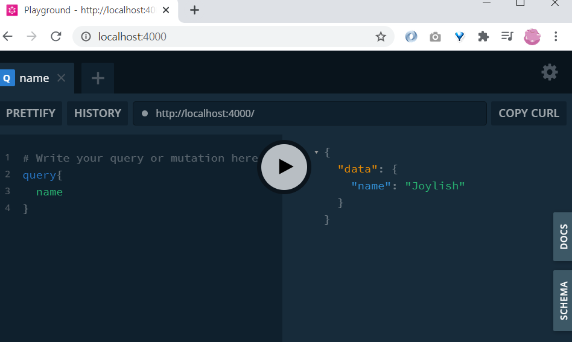
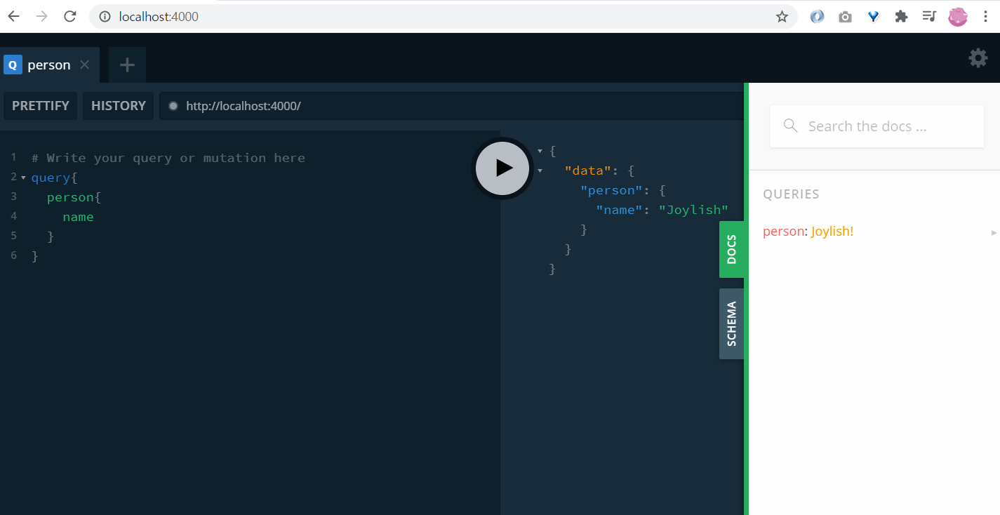

# 21.01.18

## ⭐ 개념 정리

### 개념1

#### Graphql로 해결할 수 있는 문제

   * over-fetching
   * under-fetching
   * 기존 rest api는 url 필요
        * url
        * parameter
        * form-data
        * body-parse
        * requet 객체

#### Graphql 주요특징

- **하나의 종점(end point)** = URL체계가 필요 없다.

- **Query**와 **Resolver**로 원하는 정보 요청

  - resolver에 argument를 주어 특정 정보 요청 가능

- **type**이 있다. schema에 새로운 type을 정의할 수 있다.

  

### 개념2

### GraphQL 서버 빠르게 만들기

#### "graphql-yoga"를 쓰면 된다.

create-react-app로 react app을 편리하게 만들 수 있듯이 graphql-yoga로 graphql 서버를 만들 수 있다. 기본포트는 **4000**이다.

```javascript
import { GraphQLServer } from "graphql-yoga";
import resolvers from "./graphql/resolvers";

const server = new GraphQLServer({
  typeDefs: "graphql/schema.graphql",
  resolvers,
});

server.start(() => console.log("Now Graphql Server Running!!"));

```


서버로 query를 보낼 때 이 모든 요청은 post로 간다. request body에 query가 전달된다.




### 개념3

#### schema

클라이언트에게 받거나 줄 정보에 대한 서술

#### query

클라이언트가 데이터베이스로부터 **정보를 얻기** 위한 작업

```
type Query{
  name: String!
}
```

위 Query의 의미는 다음과 같다. **Query에 name을 보내면 String을 보낸다**는 것이다.

#### resolvers

"schema에 정의한 query에 대응"

**schema에 정의한 query는 데이터베이스에게 풀어야 하는 어떤 문제**같은 것이다. 이 문제, query를 해결하는 것이 resolver다. resolver는 js로 작성할 수 있다.

즉, **query에 정의하지 않은 property**에 대한 것을 resolver에 정의하는 것은 옳지 않다. 

```javascript
const resolvers = {
  Query: {
    name: () => "Joylish",
  },
};
```

graphql에는 view, url이 없고 **query와 resolver**가 있다. 다른 데이터베이스 또는 다른 API에 접근할 수 있다. 

#### 새로운 타입 정의

primitive type(String, Int, ...) 이외 schema 파일에 query로 새로운 타입을 만들 수 있다.

```
type Joylish{
  name: String!
  age: Int!
  gender: String!
}

type Query{
  person: Joylish!
}
```

이에 대한 resolver는 다음과 같다.

```javascript
const joylish = {
  name: "Joylish",
  age: "27",
  gender: "female",
};

const resolvers = {
  Query: {
    person: () => joylish,
  },
};

export default resolvers;
```




#### query에서 argument를 이용하여 특정데이터 읽기

```
type Query{
	리소스/프로퍼티(인자이름: 타입): 반환타입
}
```

schema에 여러 개 데이터 중 특정 데이터를 가져오는 query를 작성할 수 있다. 이 때, 해당 query에 대한 인자를 넘겨 줄 수 있다. 형식은 위와 같다.

```
// schema.graphql
type Person{
  id: Int!
  name: String!
  age: Int!
  gender: String!
}

type Query{
  people: [Person]!
  person(id: Int!): Person
}
```

**Resolver에는 어떤 것도 가능하다. 다른 DB 또는 다른 API에 접근할 수 있다** 

```
Query: { 
	리소스/프로퍼티: [Operation 정의]
}
```

schema에서 새로운 타입 Person이 되어 있고 people과 person에 대한 query가 정의되어 있다. resolver에는 people과 persone에 대한 operation이 필요하다.

```javascript
// resolvers.js
import { people, getById } from "./db";
const resolvers = {
  Query: {
    people: () => people,
    person: (_, { id }) => getById(id),
  },
};

export default resolvers;
```

😎 resolver의 operation 인자에 대한 공부가 필요함!!


#### mutation

클라이언트가 서버 또는 데이터베이스 또는 메모리부터 **정보를 바꾸기** 위한 작업


#### 기존 rest api를 graphql로 감싸기 

추가