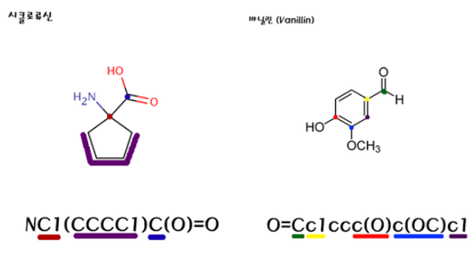

## SMILES (Simplified Molecular Input Line Entry System) 

[ SMILES 규칙 참고자료](https://lsy5518.wordpress.com/2014/11/10/1198/)

> 1. 원자는 표준 원소기호로 나타냅니다.
> 2. 수소원자는 가능한 모든 곳에 연결되어 있다고 하고, 표기에는 생략합니다.
> 3. 이웃한 원자는 바로 인접해서 씁니다.
> 4. 2중결합은 ‘=’ 으로, 3중결합은 ‘#’으로 나타냅니다.
> 5. 가지는 괄호 ‘()’를 써서 나타냅니다.
> 6.  고리는 고리를 만드는 두 원자에 숫자를 표기하는 것으로 나타냅니다.

추가로 고려해야할 요소 

* 대문자와 소문자의 의미가 다르다.
*  4면체를 이루는 탄소에 @@
*  이중결합을 사이에 둔 cis-, trans- 같은 경우 ‘/’ 나 ‘\’ 

## InceptionV3

케라스에서 제공하는 함수. imagenet으로 미리 train 됨. 이 함수를 통해서 이미지 feature를 추출할 수 있음