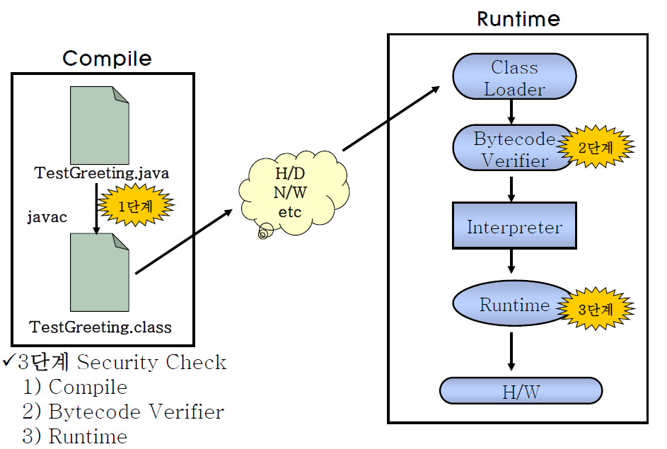
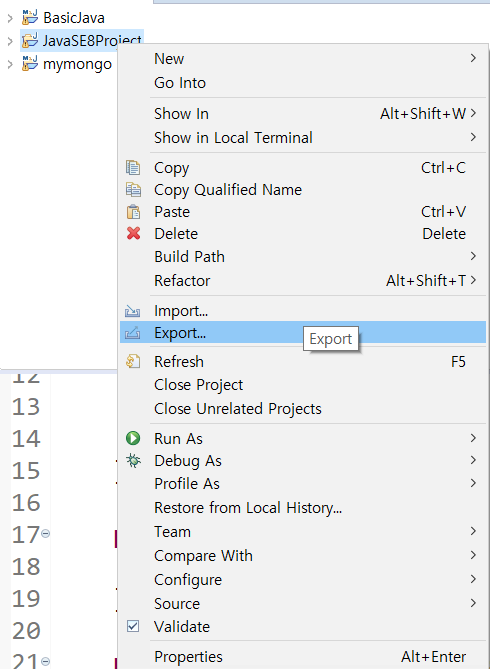
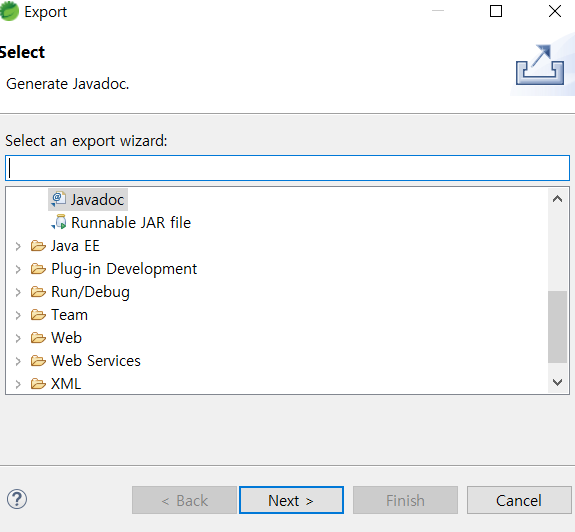
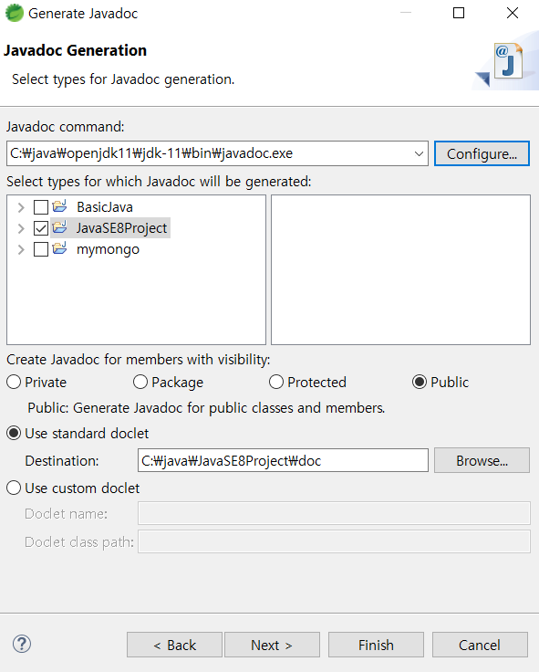
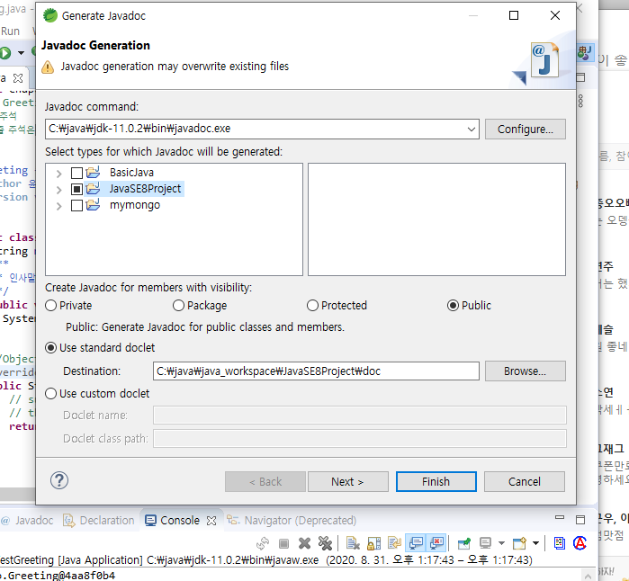
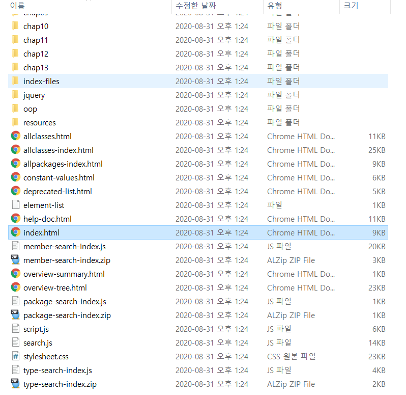
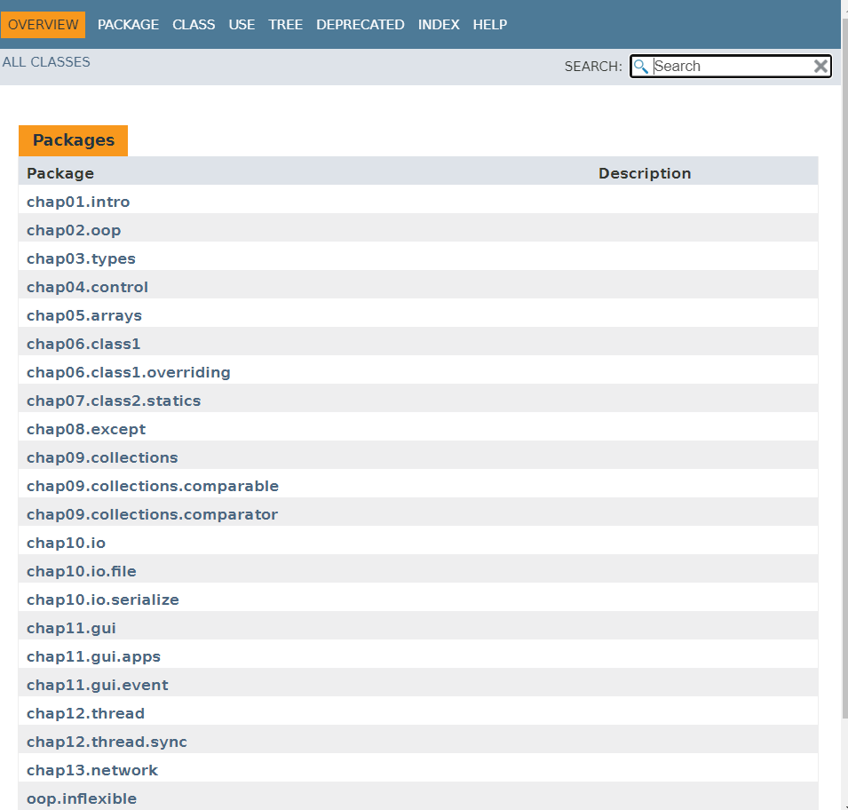

# Java를 잡아라

Java는 **플랫폼(OS;운영체제)에 독립적**이다. 즉, windows에서 개발하고 배포해도 linux환경에서 실행가능하다는 것이다.

> .java → .class (byte code) → ~~assembly code(운영체제에 특화됨)~~ X

assembly code로 되어 있지 않다. byte code로 된 파일(.class)은 어떤 JVM(Java Virtual Machine)에서도 실행할 수 있다. 

#### JVM

JVM은 **플랫폼(OS;운영체제)에 의존적**이다. 즉, windows의 JVM과 linux의 JVM은 서로 다르다. 

현재 내 컴퓨터 운영체제가 linux라면, windows에서 배포한 java 프로그램을 실행하려면 해당 프로그램의 바이너리 파일을 실행하기 위해 JVM이 필요하다.

##### JVM 역할

1. byte code 읽기
2. byte code 검증
3. byte code 실행
4. 실행환경(필요 라이브러리 및 파일)의 규격을 제공한다.

**Java garbage collector**


#### JRE (libraries)

JRE는  Java Runtime Environment로 자바 실행 환경을 제공한다. 앞서 말했듯이 JVM이 바이너리 코드를 읽으면서 자바 프로그램을 동작시키기 위해서 필요한 라이브러리 및 파일들이 필요하다. JRE는 자바 프로그램을 온전히 실행시킬 수 있도록 필요 라이브러리 및 기타 파일을 JVM에 제공한다.

#### JDK (utilities)

JDK는 Java Development Kit로, JRE 포함 개발 도구(javac, java 등)를 제공한다.


---

### Java 프로그램 실행순서

**상황 가정**

[토끼] java로 프로그램 만들어봐야징~

java 소스코드 완성! (**.java**) -----**컴파일**----> 클래스파일 생성(**.class**)

[거북이] 토끼가 만든 java 프로그램 실행해볼까?

**class-loader** → **bytecode verifier** → **interpreter** → **runtime**




---

### Java Platform 종류

| 종류 |                             |                                 |
| ---- | --------------------------- | ------------------------------- |
| J2SE | stand alone                 | java core, IO, collection, jdbc |
| J2EE | server base web application | servlet, jsp, ejb,jpa           |
| J2ME | micro edition               | 거의 없어짐                     |


---

#### Java Project 연습

* 클래스명은 대문자
* 패키지명은 소문자
* 메서드명, 변수명은 소문자

``` java
Greeting greet = new Greeting()
```

greet이라는 변수는 stack영역에서 메모리 할당을 받는다.

new 연산자로 객체를 생성하면 heap힙 영역에서 메모리 할당을 받는다.

생성된 Greeting 객체가 greet이라는 변수에 할당되는 것은 **stack영역에서 메모리를 할당받은 greet 가 heap 영역에서 메모리 할당받은 Greeting 객체를 참조하게 되는 것이다.** 

garbage collector는 greet가 속한 영역 **'}'**이 끝날 때 greet에 할당된 메모리를 해제한다.


---

#### generate javadoc

project explorer에서 doc으로 만들 프로젝트에서 우클릭한다.






**현재 STS에서 사용중인 jdk의 javadoc.exe를 설정해준다.**







**생성된 doc폴더에 있는 index.html에 들어간다!**






---

#### overloading

같은 클래스 내부에서 메소드 이름은 같고 인자가 다른 경우를 말한다.

* 오버로딩 **규칙**

> 1. **같은 클래스** 내부에서 **메서드명이 같아**야 한다.
> 2. **아규먼트 타입이 달라야 한다.**
> 3. **리턴타입이 같을 수 있고 다를 수 있다.**

* 오버로딩 **장점**

  인터페이스가 간단/단순해진다.

#### overriding

상속받은 부모 클래스에 정의된 똑같은 메소드를 현재 클래스에서 재정의하는 경우를 말한다.

@Override 어노테이션은 컴파일 타임에 매서드 재정의 규칙을 준수했는지 체크해주는 역할이다.

> 오버라이딩 규칙
>
> 1.  **재정의하는  메서드의 선언부는 반드시 같아야 한다.**
> 2.  **구현부는 달라야한다.**


----

#### 객체

#### 객체 멤버변수 초기화

1. default value로 초기화 = 선어언과 동시에 자동으로 초기화
2. 명시적 초기화
3. constructor에 의한 초기화


### Reference vs Primitive

#### Primitive

기본 데이터 타입으로 단일 값

#### Reference

Primitive type을 제외한 모든 Data Type은 Reference type

Reference type의 변수는 new를 이용해 생성한 객체의 주소 값을 가진다.