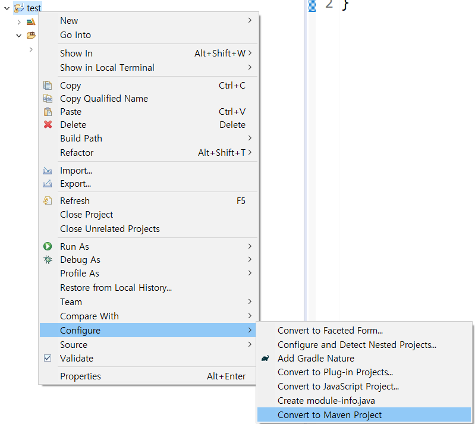
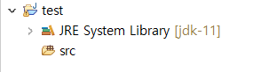

# Apache Maven

**Java계열에서 대표적인 load package manager**

javascript 계열에서 대표적인 load package manager는 npm

[mongo java driver](https://mongodb.github.io/mongo-java-driver/)

[maven repository](https://mvnrepository.com/) 에서 **mongo java driver** 검색

#### Maven 설정 방법 2가지

1. 기존 Java project를 Maven project로 변환(convert)
2. 처음부터 Maven project로 생성

그러면 pom.xml 파일 생성된다!

#### 1) 기존 Java project를 Maven project로 변환(convert)

test라는 프로젝트를 생성했다. 해당 프로젝트를 maven 프로젝트로 변환하기 위해  Configure → Convert to Maven Project로 해준다.

**Convert to Maven Project** 를 누르면 다음과 같은 창이 뜬다. POM.xml을 정해줄 수 있다.

Finish를 누르면 디렉토리는 다음과 같은 구조를 갖는다.

내가 만든 java maven 프로젝트에서 mongodb를 사용해야 하는 경우라면, maven repository에서 mongodb를 검색해서 maven dependency를 복사하여 pom.xml에 dependency를 추가 해준다. 

dependency 추가 이후 재시작(ctrl+f5)하면 추가된 dependency가 컴파일이 되면서 maven dependencies에 추가된다.

------

#### 2) 처음부터 Maven project로 생성

#### Maven에서 라이브러리 설치 방식

* pom.xml에 dependency 추가

* .m2