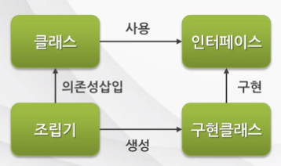

### 프레임워크

#### 프레임워크 = 디자인 패턴 + 라이브러리

프레임워크 라이브러리를 살펴볼 때도 적용된 패턴을 주목해서 살펴 보아야 한다.

#### 1. 프레임워크와 디자인패턴

* **디자인패턴**: 구조적인 가이드라인 


#### 2. 프레임워크와 라이브러리

**제어의 주도권**을 누가 가지고 있니? **실행제어**가 어디서 일어나니?

* **라이브러리, api** → 개발자
* **프레임워크** → 프레임워크


#### 왜 프레임워크는 주도권을  가져갔을까?

개발자(유저)가 신경 써야할 부분을 줄여 **비즈니스 로직** 개발에 집중할 수 있는 환경을 제공하기 위해서 


##### 1. **IoC (Inversion of Control)** : 제어의 역전 

프레임워크는 인스턴스 생성부터 소멸까지의 **인스턴스 생명주기 관리**를 개발자가 아닌 컨테이너가 대신 해준다. 프레임워크는 컨테이너로, 개발자, 즉 유저를 대신해서 제어 권한을 갖는다. 즉,  **일반적인 프로그램 흐름과 반대로 동작**한다. 이를 IoC라고 한다. 


개발에 집중할 수 있도록 대신 **프레임워크가 유저코드를 호출해서 객체를 생성**한다. 생성한 객체는 **singleton 객체**가 된다. 이렇게 프레임워크가 **기반이 되는 객체**를 생성한다. Spring 컨테이너는 IoC를 지원하고 XML 설정 메타 데이터로 **beans**를 관리하여 어플리케이션의 기반 객체를 생성한다.


**2. DI (Dependency Injection)**

A, B 객체가 있을 때, A가 B를 객체의 메서드를 호출한다고 하자. 프레임워크는 객체 A에 B의 레퍼런스 주소를 심어준다. 이렇게 프레임워크가 **객체간의 의존성**을 주입해준다. 다시 정리하면, <u>구현 클래스의 정보는 xml(설정파일)에 작성되어 있다. 

컨테이너는 xml파일을 읽은 후,

1. 구현 객체를 생성

2. 각 클래스간의 의존관계를 빈 설정(Bean Definition) 정보 기반 연결



* **Setter Injection**

* **Constructor Injection**

* **Method Injection**

한 마디로 프레임워크는 infrastructure 제공자이다. 프레임워크는 라이브러리 형태로 특정 부분의 기술적 구현을 제공한다.

**DI 의 장점**

\- 코드 단순화

\- 컴포넌트 간의 결합도 제거


```
(상황) Hello 클래스는 String Printer 클래스와 의존 관계이다.

하지만 new 연산자로 String Printer를 객체를 따로 선언하지 않았다. 대신에 상위 인터페이스인 Printer를 타입으로 가진 메서드를 생성한다! 
```


```java
package myspring.di.annot;
 
public class Hello {
 
    private String name;
    private Printer printer;
    
    public Hello() {}
 
    public Hello(String name, Printer printer) {
        super();
        this.name = name;
        this.printer = printer;
    }
    
    public void setName(String name) {
        this.name = name;
    }
 
    public void setPrinter(Printer printer) {
        this.printer = printer;
    }
 
    public String sayHellow() {
        return "Hello " + name;
    }
 
    public void print() {
        this.printer.print(sayHellow());
    }
    
}
```


----

### Spring Bean


##### Pojo(plain, old java object)

Beans라고 부른다. IoC 컨테이너에 의해 Bean는 인스턴스화, 관리, 생성된다. 


xml 파일에 컨테이너가 관리하는 Bean 객체를 정의한다.  Hello 클래스를 맵핑하여 **property** 'name'과 'printer'를 정의하여 value로 값을 넣는다.  생성자가 여러 개로 오버로딩되어 있을 경우 **constructor-arg**를 통해 특정 생성자를 지목하여 bean 객체를 생성할 수 있다. 

```xml
<bean id="hello" class="myspring.di.xml.Hello">
    <property name="name" value="Spring Study" />
    <property name="printer" ref="printer" />
</bean>
 
<bean id="helloWithTwo" class="myspring.di.xml.Hello" scope="singleton">
      <constructor-arg name="name" value="스프링" />
      <constructor-arg name="printer" ref="conPrinter" />
   </bean>
```


#### BeanFactory 

Bean을 등록,생성,조회,반환 관리한다. 해당 인터페이스에는 getBean() 메서드가 정의되어 있다.  BeanFactory은 바로 사용되지 않고 이를 확장한 ApplicationContext가 주로 사용된다.

#### ApplicationContext

BeanFactory와 동일하게 Bean 생명주기를 관리하는 기능이 정의되어 있으며 Spring의 각종 부가 서비스를 추가로 제공한다. Spring이 제공하는 ApplicationContext 구현 클래스가 여러 가지 종류가 있다.


[ DI 및 Bean 개념 관계 정리 ]

Spring DI 컨테이너가 관리하는 객체를 **bean**이라고 하고, 이 빈(bean)들을 관리하는 컨테이너는 **BeanFactory** 라고 부른다.

 DI 관점에서 **객체의 생성과 객체 사이의 Runtime 관계**를  컨테이너를 **BeanFactory**라고 한다.

하지만 사용자는 BeanFactory에 여러 가지 컨테이너 기능이 추가된 **ApplicationContext**를 주로 이용한다.

```java
BeanFactory factory = new GenericXmlApplicationContext("config/spring_beans.xml");

Hello hello = (Hello)factory.getBean("hello");
Hello hello2 = factory.getBean("hello", Hello.class);
```

1. **GenericApplicationContext()** : bean 정보가 정의된 xml 파일을 불러와서 ApplicationContext 객체를 생성한다. 
2. **getBean()**: bean id가 hello이고 Hello 클래스인 bean 객체를 생성한다.  


---

### 싱글톤

하나의 프로그램에서 하나의 클래스의 단 하나의 인스턴스만을 사용해야하는 상황에 주로 사용된다.

#### 왜 필요한가

처음에만 로딩해주면 되는 사용자 정보와 관련된 UserManager가 있을 때, 매번 인스턴스를 생성하는 것은 자원 낭비되거나 인스턴스가 꼬일 수 있다.


#### 어떻게 사용되는가

```java
// 싱글톤 인스턴스
private static UserManager INSTANCE = null;

// 
```


