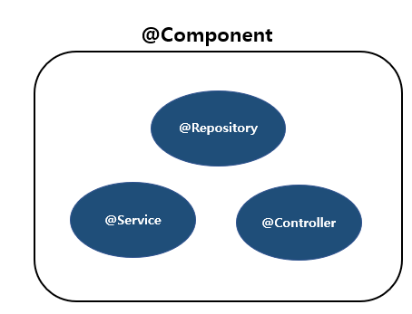
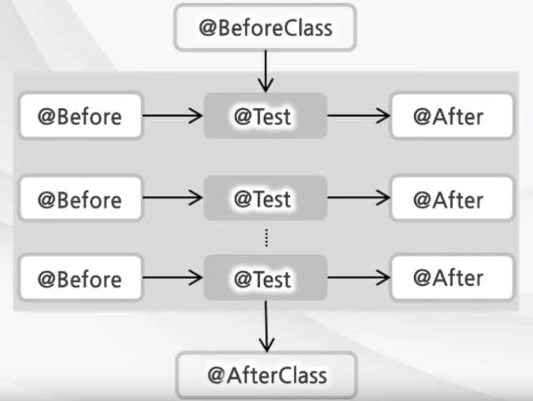

### 어노테이션이란 무엇일까

#### 어떤 역할? 

##### 컴파일 또는 런타임에 '@' 로 컨텍스트들을 제공 받을 수 있도록 한다.


### Bean 등록 및 의존관계 어노테이션 :smile:

#### 1. Bean 등록 어노테이션



| 어노테이션  |      |
| ----------- | ---- |
| @Component  |      |
| @Repository |      |
| @Service    |      |
| @Controller |      |


#### 2. DI(Dependency Injection) 처리 어노테이션

| 어노테이션      | 설명                                                         |
| --------------- | ------------------------------------------------------------ |
| **★@Autowired** | <u>프로퍼티, setter 메서드, 생성자, 일반메서드</u> 적용<br />**Type**을 이용해서 의존하는 객체를 주입해줌 |
| **@Resource**   | <u>프로퍼티, setter 메서드</u> 적용<br />**bean id**를 통해 의존하는 객체를 주입해줌 |
| **@Value**      | 단순 값 주입                                                 |
| **@Qualifier**  | 단독으로 사용 못함! 항상 @Autowired 어노테이션과 함께!<br />동일한 **타입**의 Bean 객체가 여러 개 있을 때 **bean id**를 통해 특정 bean을 찾는다 |


---

### TestCase 

#### 1. 단위테스트 Junit

##### 주요 메서드 Assert

```java
import static 
```

assert 메서드로 독립된 테스트 케이스의 수행 결과를 판별한다.

| assert 메서드       |                                      |
| ------------------- | ------------------------------------ |
| assertEquals(a, b); | 객체 A와 B의 실제 값이 일치한지 확인 |
| assertSame(a, b);   | 객체 A와 B가 같은 객체임을 확인      |
| assertTrue(a);      | 조건 A가 참인가를 확인               |
| assertNotNull(a);   | 객체 A가 null이 아님을 확인          |


##### JUnit 테스트 지원 어노테이션

| 어노테이션   | 설명                                                         |
| ------------ | ------------------------------------------------------------ |
| @Test        | 단위 테스트 대상                                             |
| @Ignore      | 테스트 하지 않는 메소드라는 것                               |
| @Before      | 단위 테스트 메소드 실행 전 실행해야하는 부분<br /><u>보통 단위 테스트 메소드들이 공통으로 사용하는 코드를 선언해서 사용한다</u> |
| @After       | 단위 테스트 메소드 실행 후 실행해야하는 부분                 |
| @BeforeClass | 단위 테스트 메소드보다 먼저 **한번만** 수행되어야 하는 경우  |
| @AfterClass  | 단위 테스트 메소드보다 나중에 **한번만** 수행되어야 하는 경우 |



### Spring Test 프레임워크 테스트


