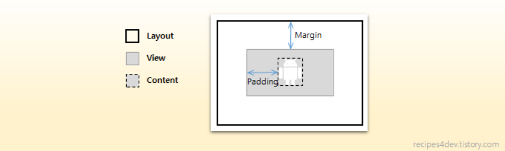
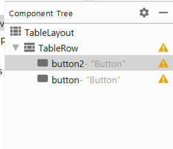

# 안드로이드 공부하면서 정리하기

### 이벤트와 리스트뷰

#### 0. 모르는 용어 정리

* layout_width = "**match_parent**"

  해당 객체 컨테이너의 길이만큼 모두 채우는 것이다.

* layout_width = "**fill_parent**"

  match_parent 와 동일하다. match_parent를 쓰는 것이 바람직하다고 한다.

* layout_height = "**wrap_content**"

  해당 객체 컨테이너의 내용 크기만큼 레이아웃 또는 view 위젯 크기가 결정된다. 

* layout_**margin** = "20dp"

  상위 레이아웃과 view 위젯 <u>사이</u> 공간의 크기를 정한다. 상하좌우에 대한 값을 지정할 수 있다.

  * layout_marginLeft
  * layout_marginTop
  * layout_marginRight
  * layout_marginBottom

* layout_**padding** = "10dp"

  view 위젯과 view 안에 실제 내용 사이의 공간의 크기를 정한다. margin처럼 상하좌우에 대한 값을 지정할 수 있다.

  - layout_paddingLeft
  - layout_paddingTop
  - layout_paddingRight
  - layout_paddingBottom

  


#### 1.테이블 레이아웃

~~리니어 레이아웃~~을 활용하지 않고 조금 더 쉽게 격자모양으로 뷰를 배치할 때 사용한다.

```xml
<?xml version="1.0" encoding="utf-8"?>
<TableLayout xmlns:android="http://schemas.android.com/apk/res/android"
    android:layout_width="match_parent"
    android:layout_height="match_parent" >

    <TableRow
        android:layout_width="match_parent"
        android:layout_height="wrap_content">
	</TableRow>
</TableLayout>
```


activitymain이 다음과 같을 때 현재 tablerow에 대한 height의 값이 없기 때문에 Design탭에서 화면으로 button을 drag and drop하기 힘들다. 이럴 때는 <u>component tree에서 tablerow로 button을 drag하여 추가한다.</u>




